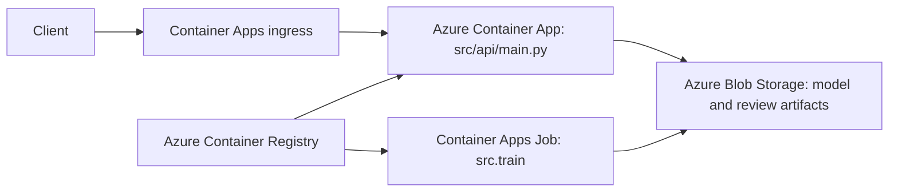

# Deployment Design

## 1. Architecture Overview

This design deploys the existing containerized application to Azure without
changing its core separation of responsibilities. Milestone 14 already uses
one Dockerfile with two commands: python -m src.train produces artifacts and
Uvicorn serves src.api.main:app. In Azure, the trainer becomes a one-off
Container Apps Job and the API becomes a long-running Azure Container App.
Azure Blob Storage replaces the local model-artifacts named Docker volume so
the job and API replicas can share immutable artifacts without being coupled
to the same host.

The trainer is intentionally outside the live request path. It is run on
demand or on a schedule to create a versioned model artifact; requests only
reach the API after it has loaded an approved artifact at startup.

## 2. Core Requirements Mapping

### Container registry: Azure Container Registry

Azure Container Registry (ACR) stores the image built from this repository's
single Dockerfile. The image supports both existing Compose commands: the
trainer command and the Uvicorn API command, so one tagged image captures the
same source and dependencies for both workloads. Tagging images by git commit
or release version makes the API and trainer versions traceable.

### Container runtime: Azure Container Apps

Azure Container Apps is appropriate because this project has two different
execution shapes. The api command is a long-running HTTP service, while
python -m src.train is a bounded artifact-producing job. A Container Apps Job
can run the trainer once or on a schedule and exit, whereas a Container App
can expose the FastAPI service, autoscale for traffic, and remain available
for health checks.

### Object storage: Azure Blob Storage

An Azure Blob Storage container replaces Compose's local model-artifacts
volume. The trainer writes model.joblib, metrics.json, shap_summary.json,
lime_summary.json, and model_review.md to a versioned artifact location; the
API reads the selected model and report artifacts from that location. The
production API should download the selected model blob during startup to the
container filesystem before invoking the existing startup loader, preserving
Milestone 13's load-once behavior.

### Secret management: Azure Key Vault

The default project configuration has minimal secret requirements:
recommendation_chain.py uses a deterministic local mock and requires no LLM
API key. If a real LLM is introduced later, its key belongs in Azure Key Vault
and is exposed to the relevant Container App through a secret reference, never
through an environment file, Compose configuration, the image, or source
control. Future storage connection material should likewise use managed
identity where possible rather than a stored secret.

### Logging: Azure Monitor and Log Analytics

Azure Monitor sends container stdout and stderr to a Log Analytics workspace.
The existing src.utils.logger.configure_logging format already emits a
timestamp, level, logger name, and message, which maps naturally into
queryable logs. This supports investigation of trainer failures, startup model
load errors, and prediction or explanation exceptions without adding a second
logging configuration inside the application.

### Monitoring: Azure Monitor and Application Insights

Azure Monitor and Application Insights should track availability through
GET /health, request latency, and response status. Alerts should focus on
failure rates for POST /predict and POST /explain, because the API explicitly
returns 503 when the startup model is unavailable and 500 for client-safe
inference failures. Health-check availability, p95 endpoint latency, and
artifact-load failures are the most useful initial signals.

### IAM: Azure Managed Identity

Each Container Apps resource receives its own managed identity. The API
identity receives Storage Blob Data Reader for the artifact container, while
the trainer identity receives Storage Blob Data Contributor to write artifacts.
Key Vault Secrets User is assigned only if future secrets are added. This
least-privilege model avoids long-lived credentials in images, files, or
environment configuration.

## 3. Request Flow

1. A client sends POST /predict to the Container Apps public ingress.
2. Ingress routes the request to a healthy src.api.main:app replica.
3. At replica startup, the selected Blob artifact has already been downloaded
   and loaded once by the FastAPI lifespan handler; it is not fetched or
   deserialized per request.
4. Pydantic validates all 30 feature values, and the API builds the original
   sklearn-ordered single-row input.
5. The loaded pipeline returns the class and probability, and FastAPI sends
   the safe response. Errors follow the existing 503/500 client-safe behavior.

## 4. Deployment Steps

1. Build the Docker image from the existing Dockerfile and tag it with a
   release or commit identifier.
2. Push that image to ACR.
3. Deploy or update the Container Apps Job using the trainer command.
4. Run the job once and confirm that its versioned model and JSON artifacts
   are present in Blob Storage.
5. Deploy or update the API Container App with the same image, Blob access,
   and the selected artifact version supplied as configuration.
6. Verify GET /health reports model_loaded: true, then exercise POST /predict
   with a validated benchmark request.

These are operational steps, not a claim that this repository has been
deployed to Azure.

## 5. Secrets Handling

Values documented by .env.example, such as log level, artifact location, and
agent limits, become Container Apps environment variables at deployment time.
Non-secret configuration can be set directly; future sensitive values such as
LANGCHAIN_LLM_API_KEY are Key Vault references. No secret is baked into the
Docker image, committed to git, or placed in the Compose file.

## 6. Model Artifact Storage

The Compose named volume is convenient for local sequencing, but Blob Storage
is the cloud equivalent for durable cross-container artifacts. Versioning blobs
by timestamp or commit SHA lets the trainer publish an immutable artifact set.
Multiple API replicas can read the same chosen version independently, so API
scaling requires no shared-filesystem locking or coordination.

## 7. Rollback Approach

Keep the prior API image tag in ACR and retain prior versioned artifact
directories in Blob Storage. If an API release fails, update the Container App
to the preceding image tag. If a trainer run produces an unsuitable model,
point the API configuration back to the previous artifact version and restart
or revise the API revision so its startup loader retrieves that known-good
model.

## 8. Scaling Approach

Use Container Apps HTTP-based autoscaling for the API, with concurrency-based
scale-out because POST /predict and POST /explain are the load-bearing
endpoints. Set conservative minimum replicas when cold-start latency is
unacceptable, and use Monitor metrics to tune maximum replicas. The trainer
must not autoscale: it is a one-shot artifact-generation job whose controlled
execution and output versioning are more important than serving request
throughput.
