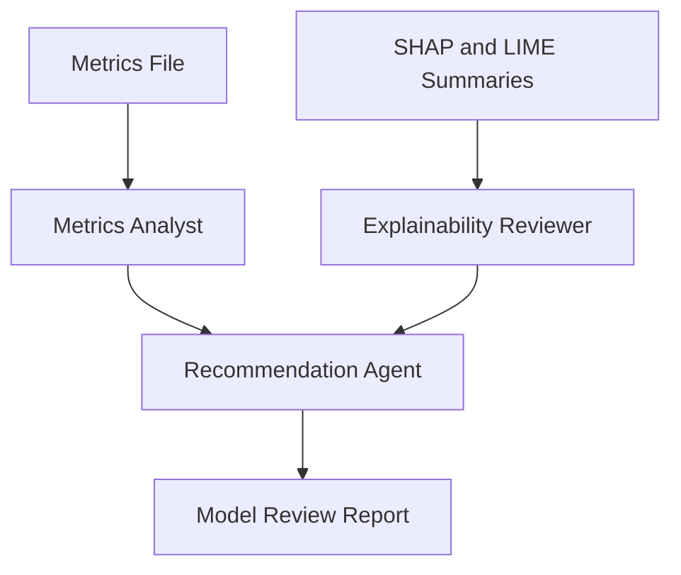

# Architecture

## Agent Pipeline

### Chain versus agent

A chain such as recommendation_chain.py follows a fixed prompt, runnable, and
parser sequence without autonomous tool selection. An agent has a role and
goal, can decide which available tool to invoke, and synthesizes results for
its assigned task.

### Agent versus tool

An agent is the decision-maker that interprets its task and coordinates its
available capabilities. Tools are the concrete functions it calls, such as
read_metrics_file or compute_weighted_business_cost, to retrieve evidence or
perform a bounded calculation.

### The role of the LLM

The LLM interprets task descriptions, chooses a useful order for tool calls
within each agent's constraints, and converts findings into natural-language
review content. It does not replace artifact validation or independently
computed business-cost checks embedded in the tools.

### How agents choose tools

Agents choose tools from their declared names and docstrings in response to
their task descriptions. In this project, the Metrics Analyst receives tools
whose docstrings describe reading metrics and recomputing cost, while the
Explainability Reviewer receives the summary-reader tool.

### How infinite loops can occur

An agent can repeatedly invoke a tool when its outputs never satisfy the task,
or agents can create circular delegation in a hierarchical process. This
workflow avoids delegation and fixed sequential tasks reduce the opportunity
for circular work, but a broken external call could still stall execution.

### Why maximum iterations and timeouts matter

Each agent is configured with an explicit max_iter, and run_model_review also
wraps kickoff in a wall-clock timeout. These two limits provide separate
guardrails: one caps reasoning steps and the other prevents a stuck crew from
running indefinitely.

### When deterministic workflows are better

Part D's pipeline selection is deterministic, auditable, and reproducible, so
it is preferable when production reliability requires a fixed decision rule.
This agent crew is more flexible for synthesizing metrics and explanations,
but that flexibility makes it less predictable than a deterministic workflow.
